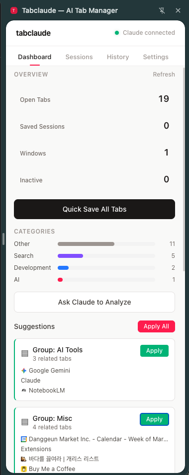
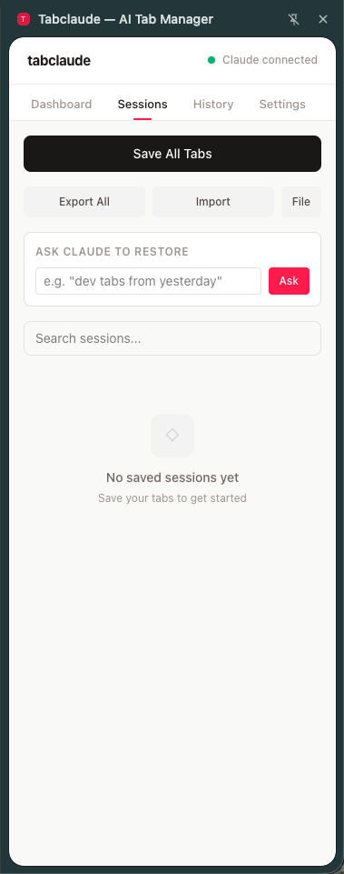
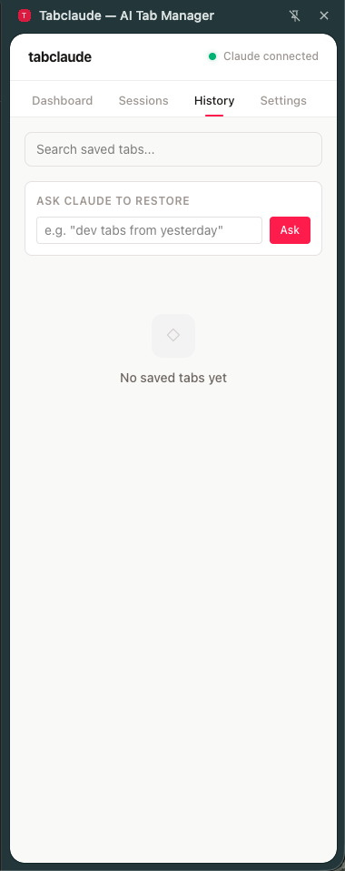
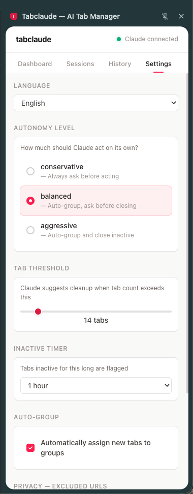

# Tabclaude

[](https://buymeacoffee.com/sh_brady)

AI-powered tab manager for Chrome. Save, organize, and restore browser tabs with Claude CLI integration.

A modern replacement for OneTab — with sessions, search, import/export, and optional AI analysis.

## Screenshots

<p align="center">
  
  
  
  
</p>

## Features

### Core (works without Claude)
- **One-click save** — `Cmd+Shift+O` to save all tabs as a session and close them
- **Session management** — Lock, star, rename, restore, delete sessions
- **Non-destructive restore** — Restoring opens tabs without removing the session
- **Search** — Find sessions by name or tab content
- **Import/Export** — OneTab-compatible plain text format
- **Undo** — 5-second undo toast on delete actions
- **Tab analytics** — Dashboard with tab counts, categories, inactive/duplicate detection
- **Multi-language** — English, Korean, Japanese, Chinese

### AI-powered (requires Claude CLI)
- **Smart analysis** — Claude analyzes tabs and suggests grouping/closing
- **Natural language restore** — "open my dev tabs from yesterday"
- **Auto-naming** — Sessions named by dominant domain or timestamp
- **Configurable autonomy** — Conservative, balanced, or aggressive automation

## Install

### Extension

1. Clone this repo
2. `npm install && npm run build`
3. Open `chrome://extensions` → Developer mode → Load unpacked → select `extension/dist`

### Claude AI features (optional)

```bash
# 1. Install Claude CLI
npm install -g @anthropic-ai/claude-code

# 2. Install native messaging host
npm install -g tabclaude-host

# 3. Restart Chrome
```

The setup guide also appears in the extension when Claude is not connected.

## Usage

| Action | How |
|--------|-----|
| Open side panel | Click the Tabclaude toolbar icon |
| Save all tabs | `Cmd+Shift+O` (Mac) / `Ctrl+Shift+O` (Windows/Linux) |
| Save all tabs (UI) | Sessions tab → "Save All Tabs" button |
| Quick save | Dashboard → "Quick Save All Tabs" |
| Restore session | Click ↺ on a session card |
| Restore single tab | Expand session → click "Open" |
| Lock session | Click 🔒 to prevent deletion |
| Star session | Click ★ to pin to top |
| Search | Sessions tab → search bar |
| Import from OneTab | Sessions tab → Import → paste text |
| Export | Sessions tab → Export All (copies to clipboard) |
| Change language | Settings → Language dropdown |
| Ask Claude | Dashboard → "Ask Claude to Analyze" |

## Architecture

```
Chrome Extension (React + Vite + TypeScript)
    │
    │ Chrome Native Messaging
    │
Native Host (Node.js)
    │
    │ child_process.execFile
    │
Claude CLI
```

- **Extension** — Manifest V3 service worker + React side panel UI
- **Native Host** — Bridges Chrome ↔ Claude CLI via stdin/stdout protocol
- **Storage** — IndexedDB for sessions/tabs, chrome.storage for settings

## Tech Stack

- TypeScript, React 18, Vite, Tailwind CSS v4
- Chrome Extension Manifest V3
- IndexedDB (via `idb` library)
- No additional runtime dependencies

## Project Structure

```
extension/
  public/
    manifest.json
    _locales/{en,ko,ja,zh}/     # Chrome i18n for manifest strings
  src/
    background/index.ts          # Service worker, commands, message handlers
    sidepanel/
      App.tsx                    # Main shell, navigation
      components/
        Dashboard.tsx            # Tab stats, categories, quick save
        Sessions.tsx             # Session management, import/export
        TabHistory.tsx           # Flat tab history browsing
        Settings.tsx             # Configuration, language selector
        SuggestionCard.tsx       # AI suggestion display
        UndoToast.tsx            # Undo notification
    i18n/
      index.tsx                  # I18nProvider, useT hook
      locales/{en,ko,ja,zh}.ts   # Translation files
    lib/
      types.ts                   # TypeScript interfaces
      storage.ts                 # IndexedDB operations
      messaging.ts               # Native messaging bridge
      tab-analyzer.ts            # Tab categorization, dedup
      import-export.ts           # OneTab format parser
native-host/
  host.js                        # Native messaging protocol handler
  claude-client.js               # Claude CLI executor
  scripts/
    register.js                  # Auto-register on npm install
    unregister.js                # Auto-cleanup on npm uninstall
```

## Privacy

- Incognito tabs are completely excluded
- Only URL + title metadata is sent to Claude (never page content)
- Configurable URL exclusion patterns (e.g. `*bank*`, `*health*`)
- All data stored locally in IndexedDB — no cloud sync, no telemetry

## Support

If you find Tabclaude useful, consider buying me a coffee!

<a href="https://buymeacoffee.com/sh_brady" target="_blank"></a>

## License

MIT
